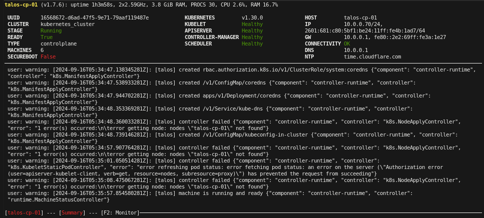

# kubernetes_iac
Terraform Kubernetes IAC

This repository was constructed by following the instructions outlined in the enlightening article mentioned below. I have made certain modifications to adapt it to my specific cluster configuration. It is worth noting that the datasets or datastores on my proxmox might have different names compared to those in your proxmox setup. Therefore, it is essential to make the necessary adjustments according to your own setup. My proxmox cluster consists of three nodes and utilizes the ceph storage solution for efficient management of virtual machines across all nodes.


Article: [Talos Cluster on Proxmox with Terraform](https://olav.ninja/talos-cluster-on-proxmox-with-terraform) by Olav

## Additional Steps

After setting up the cluster, there are a few additional steps that may be helpful to others.

### Connect to the Talos Kubernetes Cluster

To connect to your Talos Kubernetes cluster using the outputs from Terraform, you need to set up your local environment with the correct configuration files. Follow these steps:

1. Save the `kubeconfig` and `talosconfig` outputs to files on your local machine. Run the following commands:

	```bash
	terraform output -raw kubeconfig > ~/.kube/config && terraform output -raw talosconfig > ~/.talos/config
	```

	Note: Adjust the file paths if necessary.

2. Verify the file permissions for these files to avoid any security issues:

	```bash
	chmod 600 ~/.kube/config && chmod 600 ~/.talos/config
	```

### Set Up kubectl

To interact with the Kubernetes cluster, you can use `kubectl`. Here's an example command to get the list of nodes:

```
terraform output -raw kubeconfig > ~/.kube/config && terraform output -raw talosconfig > ~/.talos/config
```

This assumes you have ~/.kube/config and ~/.talos/config as the default locations for Kubernetes and Talos configurations. Adjust the file paths if necessary.
Verify File Permissions
Ensure the permissions for these files are set correctly to avoid any security issues:

```
chmod 600 ~/.kube/config && chmod 600 ~/.talos/config
```

Or you can do it all in one

```
terraform output -raw kubeconfig > ~/.kube/config && terraform output -raw talosconfig > ~/.talos/config && chmod 600 ~/.kube/config && chmod 600 ~/.talos/config
```

Set Up kubectl
Get the list of nodes

```
kubectl get nodes
NAME              STATUS   ROLES           AGE     VERSION
talos-cp-01       Ready    control-plane   3h39m   v1.30.0
talos-cp-02       Ready    control-plane   3h24m   v1.30.0
talos-cp-03       Ready    control-plane   3h24m   v1.30.0
talos-worker-01   Ready    <none>          3h39m   v1.30.0
talos-worker-02   Ready    <none>          3h24m   v1.30.0
talos-worker-03   Ready    <none>          3h24m   v1.30.0
```
Show the dashboard of one of the nodes via

```
talosctl dashboard -n talos-cp-01
```
Check the Health

```
talosctl -n talos-cp-01 health                                                                                                                        1 ↵
discovered nodes: ["10.0.0.73" "10.0.0.74" "10.0.0.75" "10.0.0.70" "10.0.0.71" "10.0.0.72"]
waiting for etcd to be healthy: ...
waiting for etcd to be healthy: OK
waiting for etcd members to be consistent across nodes: ...
waiting for etcd members to be consistent across nodes: OK
waiting for etcd members to be control plane nodes: ...
waiting for etcd members to be control plane nodes: OK
waiting for apid to be ready: ...
waiting for apid to be ready: OK
waiting for all nodes memory sizes: ...
waiting for all nodes memory sizes: OK
waiting for all nodes disk sizes: ...
waiting for all nodes disk sizes: OK
waiting for kubelet to be healthy: ...
waiting for kubelet to be healthy: OK
waiting for all nodes to finish boot sequence: ...
waiting for all nodes to finish boot sequence: OK
waiting for all k8s nodes to report: ...
waiting for all k8s nodes to report: OK
waiting for all k8s nodes to report ready: ...
waiting for all k8s nodes to report ready: OK
waiting for all control plane static pods to be running: ...
waiting for all control plane static pods to be running: OK
waiting for all control plane components to be ready: ...
waiting for all control plane components to be ready: OK
waiting for kube-proxy to report ready: ...
waiting for kube-proxy to report ready: OK
waiting for coredns to report ready: ...
waiting for coredns to report ready: OK
waiting for all k8s nodes to report schedulable: ...
waiting for all k8s nodes to report schedulable: OK
```

Check the health of the node/nodes
