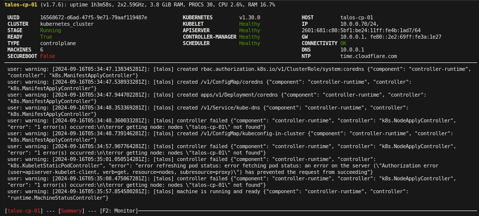

# Kubernetes IAC

Terraform Kubernetes Infrastructure as Code (IAC)

This repository was created by following the instructions in the article linked below, with modifications to suit my specific cluster configuration. Note that the datasets or datastores on my Proxmox setup may differ from yours, so adjust accordingly. My Proxmox cluster consists of three nodes and uses Ceph for efficient virtual machine management across all nodes.

**Article**: [Talos Cluster on Proxmox with Terraform](https://olav.ninja/talos-cluster-on-proxmox-with-terraform) by Olav

---

## Project Structure & Automation

### Overview

This repository provides Infrastructure as Code (IaC) for deploying and managing a Kubernetes cluster on Proxmox using [Talos](https://www.talos.dev/) and [Terraform](https://www.terraform.io/). It is designed for repeatable, automated, and declarative cluster management.

### Key Features

- **Declarative VM Provisioning:** Proxmox VMs for control plane and worker nodes are managed via Terraform.
- **Custom Talos Image:** Uses Talos Image Factory with baked-in system extensions (iSCSI tools, util-linux tools) for persistent storage support.
- **Talos OS & Kubernetes Versioning:** Talos and Kubernetes versions are parameterized in `variables.tf` for easy upgrades.
- **Automated Cluster Configuration:** Talos machine configurations are generated and applied automatically to each node.
- **Longhorn Persistent Storage:** Distributed block storage with NodePort UI access (port 30080) for volume management.
- **Rolling Upgrades:** Change a version variable and apply to safely upgrade Talos and/or Kubernetes across your cluster.
- **CI/CD Linting:** A GitHub Actions workflow automatically checks Terraform formatting and lints code on pull requests and pushes to `main`.

### How to Upgrade Talos or Kubernetes

1. Edit the version variables in `variables.tf`:
    ```hcl
    variable "talos_version" {
      default = "v1.9.5"
    }
    variable "kubernetes_version" {
      default = "1.32.0"
    }
    ```
2. Run:
    ```bash
    terraform apply
    ```
   This triggers a rolling upgrade of your cluster nodes using the new versions.

### Directory Structure

```
.
├── cluster.tf                    # Talos cluster and machine configuration resources
├── files.tf                      # Talos custom image download with system extensions
├── providers.tf                  # Terraform provider configuration
├── variables.tf                  # All input variables, including versioning
├── virtual_machines.tf           # Proxmox VM definitions for control plane and workers
├── longhorn-values.yaml          # Helm values for Longhorn persistent storage
├── LONGHORN_TALOS_SETUP.md       # Longhorn setup guide and troubleshooting
├── .github/workflows/terraform-lint.yml # CI workflow for linting
└── README.md                     # Project documentation
```

### Automation

- **Terraform Linting:**  
  On every PR or push to `main`, the `.github/workflows/terraform-lint.yml` workflow runs:
    - `terraform fmt -check -recursive`
    - `tflint --recursive`
  to ensure code quality and consistency.

---

## Talos System Extensions

This cluster uses a custom Talos image built via the [Talos Image Factory](https://factory.talos.dev/) with the following system extensions baked in:

- **iscsi-tools** (v0.2.0): Provides iSCSI initiator support for persistent storage
- **util-linux-tools** (2.41.1): Additional Linux utilities for storage management
- **qemu-guest-agent** (10.0.2): Enhanced VM integration with Proxmox

**Schematic ID**: `e187c9b90f773cd8c84e5a3265c5554ee787b2fe67b508d9f955e90e7ae8c96c`

These extensions enable Longhorn to properly manage persistent volumes on Talos nodes. The `ext-iscsid` service runs automatically on all nodes.

### Verify System Extensions

Check that extensions are installed on all nodes:
```bash
talosctl get extensions --nodes 10.0.0.70,10.0.0.71,10.0.0.72,10.0.0.73,10.0.0.74,10.0.0.75
```

Verify iSCSI service is running:
```bash
talosctl get services --nodes 10.0.0.73,10.0.0.74,10.0.0.75 | grep ext-iscsid
```

---

## Persistent Storage with Longhorn

This cluster includes [Longhorn](https://longhorn.io/) for distributed block storage across worker nodes.

### Longhorn Features

- **Distributed Storage**: Replicated volumes across multiple nodes for high availability
- **Dynamic Provisioning**: Automatic PersistentVolume creation via StorageClasses
- **Web UI**: Accessible via NodePort on port 30080 (http://NODE_IP:30080)
- **Backup & Restore**: Volume snapshots and backup capabilities
- **Pod Security**: Configured with privileged permissions in `longhorn-system` namespace

### Install Longhorn

Longhorn is deployed using Helm with custom values:

```bash
helm repo add longhorn https://charts.longhorn.io
helm repo update
helm install longhorn longhorn/longhorn \
  --namespace longhorn-system \
  --create-namespace \
  --values longhorn-values.yaml
```

### Configure Pod Security for Longhorn

Longhorn requires privileged pod security. Apply labels to the namespace:

```bash
kubectl label namespace longhorn-system \
  pod-security.kubernetes.io/enforce=privileged \
  pod-security.kubernetes.io/audit=privileged \
  pod-security.kubernetes.io/warn=privileged
```

### Verify Longhorn Installation

Check that all Longhorn pods are running:
```bash
kubectl get pods -n longhorn-system
```

Verify storage classes are created:
```bash
kubectl get storageclass
```

Expected output:
```
NAME                 PROVISIONER          RECLAIMPOLICY   VOLUMEBINDINGMODE   ALLOWVOLUMEEXPANSION   AGE
longhorn (default)   driver.longhorn.io   Delete          Immediate           true                   5m
longhorn-static      driver.longhorn.io   Delete          Immediate           true                   5m
```

### Access Longhorn UI

Access the Longhorn web interface at:
```
http://<any-node-ip>:30080
```

For detailed setup instructions, troubleshooting, and disk management, see [LONGHORN_TALOS_SETUP.md](LONGHORN_TALOS_SETUP.md).

---

## Additional Steps

After setting up the cluster, you may find the following steps helpful.

### Connect to the Talos Kubernetes Cluster

To connect to your Talos Kubernetes cluster using Terraform outputs, configure your local environment as follows:

1. Save the `kubeconfig` and `talosconfig` outputs to files on your local machine:
	```bash
	terraform output -raw kubeconfig > ~/.kube/config
	terraform output -raw talosconfig > ~/.talos/config
	```

2. Set appropriate file permissions to avoid security issues:
	```bash
	chmod 600 ~/.kube/config ~/.talos/config
	```

### Set Up `kubectl`

To interact with the Kubernetes cluster, use `kubectl`. For example, to list the nodes:
```bash
kubectl get nodes
```

Sample output:
```
NAME              STATUS   ROLES           AGE   VERSION
talos-cp-01       Ready    control-plane   83s   v1.32.0
talos-cp-02       Ready    control-plane   86s   v1.32.0
talos-cp-03       Ready    control-plane   85s   v1.32.0
talos-worker-01   Ready    <none>          88s   v1.32.0
talos-worker-02   Ready    <none>          86s   v1.32.0
talos-worker-03   Ready    <none>          90s   v1.32.0
```

### Use `talosctl`

- **View the Dashboard**:
  ```bash
  talosctl dashboard -n talos-cp-01
  ```

- **Check Cluster Health**:
  ```bash
  talosctl -n talos-cp-01 health
  ```
  Sample output:
  ```
  discovered nodes: ["10.0.0.73" "10.0.0.74" "10.0.0.75" "10.0.0.70" "10.0.0.71" "10.0.0.72"]
  waiting for etcd to be healthy: OK
  waiting for all k8s nodes to report ready: OK
  waiting for all control plane components to be ready: OK
  ...
  ```

- **Verify System Extensions**:
  ```bash
  talosctl get extensions --nodes 10.0.0.70
  ```
  Sample output:
  ```
  NODE        NAMESPACE   TYPE              ID   VERSION   NAME               VERSION
  10.0.0.70   runtime     ExtensionStatus   0    1         iscsi-tools        v0.2.0
  10.0.0.70   runtime     ExtensionStatus   1    1         util-linux-tools   2.41.1
  10.0.0.70   runtime     ExtensionStatus   2    1         qemu-guest-agent   10.0.2
  10.0.0.70   runtime     ExtensionStatus   3    1         schematic          e187c9b90f773cd8c84e5a3265c5554ee787b2fe67b508d9f955e90e7ae8c96c
  ```

- **Health Dashboard Example**:
  

### Reset the Cluster

If you need to start over, you can taint resources and reapply the Terraform configuration:
```bash
terraform state list | xargs -n1 terraform taint
terraform apply
```

---

Adjust paths and configurations as needed for your environment.
